# Wira

**Developer · Game Creator · Web Builder**

*Curious mind. Creative builds. A little bit of chaos.*

[GitHub Profile](https://github.com/paunryto-ui) · [Repositories](https://github.com/paunryto-ui?tab=repositories)

 

Loading motivation... please wait.

---

## About Me

Hey, I'm Wira. I enjoy building software, creating games, and turning ideas into projects I can actually run and test.

I learn by experimenting, solving problems, and improving things along the way.

- **Web development:** websites, interfaces, and web applications
- **Game development:** gameplay systems, interactive worlds, and prototypes
- **Tools and utilities:** desktop applications and automation experiments
- **Current focus:** making better projects and exploring new technologies

I believe the best way to learn is to build something, figure out what breaks, and make it better.

## Projects

<table>
<tr>
<td width="50%" valign="top">

### Chat-Ai

An experimental chat application exploring an AI assistant experience.

[View repository](https://github.com/paunryto-ui/Chat-Ai)

</td>
<td width="50%" valign="top">

### SaaS-Ai

A project exploring ideas for AI-powered online services.

[View repository](https://github.com/paunryto-ui/SaaS-Ai)

</td>
</tr>
<tr>
<td width="50%" valign="top">

### WebSite-Builder

A project focused on making website creation more approachable.

[View repository](https://github.com/paunryto-ui/WebSite-Builder)

</td>
<td width="50%" valign="top">

### apkbuilder

An experiment in packaging HTML projects as Android applications.

[View repository](https://github.com/paunryto-ui/apkbuilder)

</td>
</tr>
</table>

## Tech Stack

  

## Contribution Trail

